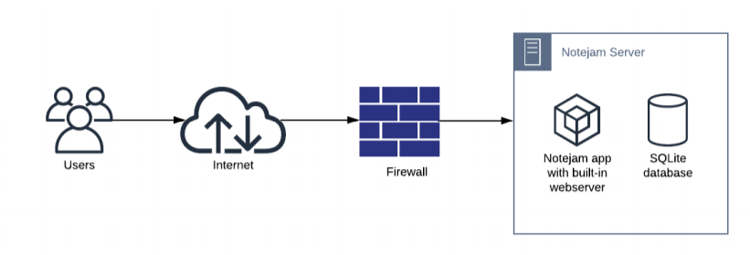

 
## Django - A web app - Deploy to Azure app service web apps - Architecture and Code
 
 
Provide architecture and implement the django application for migrating to Azure web apps PasS services. The application in scope for migration, has been implemented with django version 1.6 and python 2.7.
 
You can access, run locally and study the repo here
 
https://github.com/Nagarc/notejam
 
 
### 1. Business Requirements
 
1. The Application must serve a variable amount of traffic. Most users are active during business hours. During big events and conferences the traffic could be 4 times more than typical.
2. The Customer takes guarantee to preserve your notes up to 3 years and recover it if needed.
1. The Customer ensures continuity in service in case of datacenter failures.
2. The Service must be capable of being migrated to any regions supported by the cloud provider in case of emergency.
5. The Customer is planning to have more than 100 developers to work in this project who want to roll out multiple deployments a day without interruption / downtime.
6. The Customer wants to provision separated environments to support their development process for
development, testing, production in the near future.
7. The Customer wants to see relevant metrics and logs from the infrastructure for quality assurance and security purposes.
 
### 2. Current State Architecture

Notejam is currently build as monolith containing built-in webserver and SQLite database. Your task is to redesign the architecture so it can meet business requirements on chosen public cloud platform.

 
### 3. Migrating to Azure
 
Notejam is developed with python 2.7 and django 1.6. Keeping business interests and cost optimization, We have
three cloud migration strategies available. This strategy further can be divided into the short , medium and  long term
cloud migration strategies. These are below
 
####     3. a.  *Short Term*:
 
#### Lift and shift or Rehost:
 
Bring all the servers such as application and DB server and rehost them in cloud matching to IaaS VMs. We can migrate quickly and easily without much effort as this doesn't require any changes to the application.
 
Compute: Provision Virtual machines for application and database in multiple availability zones with auto scaling and Azure disaster recovery to another region for failover and failback.
  
####    Advantages:
      
1. This strategy involves very less effort and easy to realise cloud capabilities such as auto scaling to scale based on  demand requirements
2. Azure Disaster recovery for any data center failures and failover to another region
3. It's quick and easy. No changes needed in application or investment needed for upgrade of app to latest version
  
####    Disadvantages:
 1. Does Not offer most cost savings as we need to pay for the virtual machines and comparing to other methods explained below, this is less cost effective
2. More responsibilities are with client - infrastructure maintenance like patching, backup, security and recovering      machines during failures
3. Does not take full advantage of the cloud—legacy applications are not scalable and do not allow for distributed workloads like cloud-native applications do.
 
####     3. b.  *Medium Term*:
 
####    Infrastructure refactoring
 
Compute ( Infra refactoring) : Azure provides app services for web applications which supports Quickly build, deploy, and scale web apps and APIs on your terms. It works with .NET, .NET Core, Node.js, Java, Python or PHP, in containers or running on Windows or Linux. Azure supports Python version 3 running on windows or Linux. So to realise the medium term option and its web apps capabilities of Azure app services, this app needs to be dockerized and deployed.
 
####    Advantages:
 
1. Built-in CI/CD integration and zero-downtime deployments
2. Fully managed platform with built-in infrastructure maintenance, security patching, and scaling based on usage metrics such as HTTP queue, length, data io, memory and CPU usage
3. Rigorous security and compliance, including SOC and PCI, for seamless deployments across public cloud, Azure Governmentand on-premises environments
4. Achieve high availability with SLA-backed uptime of 99.95 percent
5. Protect your applications with Web App Firewall and connect with virtual network integration
6. DTAP ( Development, Testing, Acceptance and Production) - support with slots. Test on production grade and deploy
7. Lot of easy configurable options such as Application gateway, application insights and log analytics
8. Very cost effective
 
####    Disadvantages:
 
1. It's shared environment and many other applications run on these servers
2. Need to containerize this app as the current python version is not supported and involves some effort.
 
####     3. c.  *Long Term*:
 
Sunsetting Python version 2: January 1, 2020, was the day that Python 2 was sunset and no longer supported hence the code needed to be upgraded to Python 3. It's good to invest in upgrading the code and migrating to app services. This can be planned after implementing the medium term cloud strategy as explained above.
 
### 4. Cloud Migration Strategy
 
Based on the above analysis and realizing the best return on investment and considering the pros and cons, availability of the time, I feel the best option would be to go first for cloud migration strategy for medium term and then move the cloud journey to long term strategy to release full benefits. Azure is selected as a public cloud provider.
 
 

Below, I give an explanation of each component and its configuration

#### 4.a. _Front Door_:
 
Routes incoming requests to the primary region. If the application running that region becomes unavailable, Front Door fails over to the secondary region. it also provides below capabilities and more. This is needed to meet requirement #3 from business requirements.
 
      1. Intelligent health probe
      2. URL-path based routing for requests.
      3. Cookie-based session affinity
      4. SSL offloading and certificate management
 
Configure front door to route all the traffic to primary region and route to secondary region if primary region fails. Use a health probe to check availability of the backend.
 
#### 4.b. _Multi Region Deployment_:
 
Active and passive failover: We create two app service plans in two regions,one in active region - with P1V2 plan which serves the users and another standard app service plan in paired region which will be used and fail over to by front door when active region/data center fails.
 
#### 4.c. _Cross Region Read Replica - PostgreSql_:
 
Fully managed and intelligent Azure Database for PostgreSQL. Scale your workload quickly with ease and confidence. Enjoy high availability with up to 99.99% SLA and a choice of single zone or zone redundant high availability.
 
Configure cross-region replication for scenarios like disaster recovery planning. This configuration helps in meeting the requirement #3.
 
#### 4.d. _Auto Scaling_:
 
As per the requirement the application needs to serve variable demand. Configure P1V2 App service plan in primary region which is cost effective and can auto scale to 20 instances. This app service offers to configure auto scaling based on many matrices.
 
#### _Rule - CPU usage - Increase instance_: if CPU usage goes up beyond 70% average, add one more instance.
#### _Rule - CPU Usage - Decrease Instance_: if CPU usage goes down beyond 30% average, add decrease instance by one.
 

#### 4.e. _Deployment Slots_:
 
P1V2 provides deployment slots. We Configure three deployment slots one for development, testing, production. this meets the requirement #6.
 
#### 4.f. _Application Insights_:
 
Used to monitor your live applications. It will automatically detect performance anomalies, and includes powerful analytics tools to help you diagnose issues and to understand what users actually do with your app. It's designed to help you continuously improve performance and usability. This will ensure the quality assurance for application which is part of requirement #7.
 
_Metrics Explorer for aggregated data_:
 
Explore, filter, and segment aggregated data such as rates of requests, failures, and exceptions; response times, page load times.
 
#### 4.g. _Azure Adviser_:
 
To quickly and easily optimize your Azure deployments, Azure Advisor analyzes your configurations and usage telemetry and offers personalized, actionable recommendations to help you optimize your Azure resources for reliability, security, operational excellence, performance, and cost. This helps in realizing the requirement for the security part of the requirement # 7.
 
#### 4.h. _Backup_:
 
Configure Azure Backup for long term retention policy which is easy and cost effective. This is needed to meet the requirement #2.
 
We have the remaining requirement which is not met is the provision to work 100 plus developers with 100 plus deployments.
 
## 5. Infrastructure Deployment
 
To migrate to the cloud we need to provision the infrastructure such as app service plans, apps, databases and monitoring services.
 
Proposing Azure Devops as devops infrastructure and Azure as cloud provider.
 
Use CLI and resource manager templates to quickly deploy the infrastructure in azure. Please see below infrastructure components.
 

 
#### 5.a. _Container Registry_:
 
Create and maintain Azure container registries to store and manage private Docker container images and related artifacts. Use premium SKU to support encryption of the images. Base and standard doesn't support the encryption.
 
#### 5.b. *App Service Plan*:
 
Create app service plan P1V2 and app service under it.
 
#### 5.c. *PostgreSql*:
 
Deploy single server postgreSql server in the available region where the app is hosted.
 
#### 5.d. *Log Analytics,Application Insights and Storage account*:
 
Create Log analytics, application insights and storage accounts. Azure adviser is a default service and which helps in monitoring cost, performance and security.
 
[See for more details of this step ](Azure_Infra_deployment.md)
 
## 6. Devops -
 
Continuous deployment is a key feature for many fast-moving organizations. They need to deploy the latest version of their software quickly, but with the minimum of fuss. This specified as requirement #5 to support multiple developers and deployments a day.
 
 

 
 
#### 6.a. *Configure ACR Task*:
 
It provides cloud-based container image building for platforms including Linux, Windows, and ARM, and can automate OS and framework patching for your Docker containers.
 
Configure ACR task to build image whenever there is a change/commit in source code which automatically builds an image. We use trigger on source code update and which stored in Azure repos.
 
#### 6.b. *Webhook*:
  
Azure App Service supports continuous deployment using webhooks. We configure App service  applications to subscribe to the webhook to receive notifications about updates to images in the registry and pull the latest image to the app automatically and restart the site in predefined slot such as development.
 
 
[See for more details of this step ](/DevOps.md)
